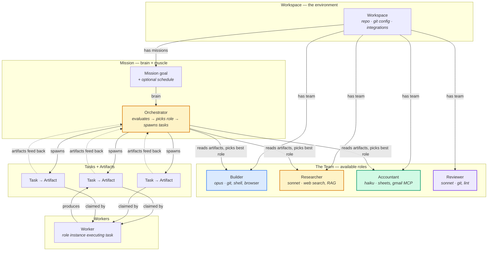

# Buildd — Architecture Plan

## Core Mental Model

```
Mission   = Brain + Muscle
Brain     = Orchestrator (built into every mission — evaluates, plans, routes)
Muscle    = Roles (who executes — model, tools, MCPs, delegation)
Artifact  = Communication protocol (every task reports back to the brain)
```

A mission isn't a dumb container of tasks. It's an **autonomous loop** that
can optimize itself over time:

```
Mission goal
  ↓
Orchestrator evaluates state (reads artifacts from prior tasks)
  ↓
Decides: what work is needed? which role is best equipped?
  ↓
Creates task(s) assigned to chosen role(s)
  ↓
Worker (role instance) executes → produces artifact
  ↓
Artifact feeds back to orchestrator
  ↓
Loop until goal is met or user intervenes
  ↓
If pattern detected → orchestrator graduates to cheaper execution
```

### Self-Optimization: Agent → Function → Cron

The orchestrator can recognize when its own evaluation is routine and
**replace itself** with a cheaper execution mode:

```
Stage 1 — Agent (expensive, flexible)
  Full orchestrator runs every cycle. Evaluates with LLM.
  Good for: new missions, complex goals, uncertain domains.

Stage 2 — Function (cheap, deterministic)
  Agent notices: "I've done the same check 5 times in a row."
  Writes a programmatic function that does the evaluation.
  Tests it. Produces artifact: "Replacing myself with automated check."
  Schedule now runs the function instead of spawning an agent.
  Agent stays on standby — function escalates on anomaly.

Stage 3 — Cron-only (cheapest, fire-and-forget)
  Function proves stable over N cycles.
  Mission becomes pure automation — no agent, no function eval.
  Just stamps out a task from template on schedule.
  Escalates back to function/agent if task fails.
```

The graduation path is reversible. A function that hits an anomaly
escalates to the agent. An agent that stabilizes graduates back to
a function. The mission finds its own equilibrium.

```
Execution modes for a mission schedule:
┌─────────────┐     pattern      ┌──────────┐     stable     ┌───────────┐
│ Orchestrator │──────found──────▶│ Function │──────over──────▶│ Cron-only │
│  (agent)     │◀────anomaly─────│ (code)   │◀────failure────│ (template)│
└─────────────┘                  └──────────┘                └───────────┘
     most flexible                 cheap + smart               cheapest
     most expensive                escalates up                escalates up
```

This means the agent's job isn't just to do the work — it's to
**build the automation that replaces itself**, then step back and
only re-engage when the automation breaks.

---

## Entity Relationships



### The Loop in Detail

```
┌──────────────────────────────────────────────────────────────┐
│                         MISSION                               │
│  Goal: "Ship auth module"                                     │
│  Schedule: every 2h (or manual trigger)                       │
│                                                               │
│  ┌─────────────────────────────────────────────────────────┐  │
│  │              ORCHESTRATOR (brain)                        │  │
│  │                                                         │  │
│  │  Inputs:                                                │  │
│  │  ├── Mission goal + description                         │  │
│  │  ├── Available roles (with capabilities)                │  │
│  │  ├── Artifacts from completed tasks                     │  │
│  │  ├── Active tasks + their status                        │  │
│  │  └── Failed tasks + error context                       │  │
│  │                                                         │  │
│  │  Decisions:                                             │  │
│  │  ├── "Auth tests need fixing → Builder is best"         │  │
│  │  ├── "Need API docs updated → Researcher can handle"    │  │
│  │  ├── "PR open, needs review → assign to Reviewer"       │  │
│  │  ├── "All done → mark mission shipped"                  │  │
│  │  └── "Task stuck 3x → escalate or try different role"   │  │
│  │                                                         │  │
│  │  API calls:                                             │  │
│  │  ├── GET  /api/roles         → list available roles     │  │
│  │  ├── GET  /api/missions/:id  → current state + artifacts│  │
│  │  ├── POST /api/tasks         → spawn work (picks role)  │  │
│  │  └── PATCH /api/missions/:id → update status            │  │
│  └─────────────────────────────────────────────────────────┘  │
│           │                              ▲                     │
│           │ spawns tasks                 │ artifacts           │
│           ▼                              │                     │
│  ┌─────────────────────────────────────────────────────────┐  │
│  │                    TASKS (muscle)                        │  │
│  │                                                         │  │
│  │  Task 1: "Fix auth middleware"                          │  │
│  │    roleSlug: builder                                    │  │
│  │    → Worker executes → produces artifact:               │  │
│  │      { type: "summary",                                 │  │
│  │        output: "Fixed CORS issue in middleware",        │  │
│  │        pr: "github.com/.../pull/42",                    │  │
│  │        status: "completed",                             │  │
│  │        nextSuggestion: "Tests pass, ready for review" } │  │
│  │                                                         │  │
│  │  Task 2: "Review auth PR #42"                           │  │
│  │    roleSlug: reviewer                                   │  │
│  │    → Worker executes → produces artifact:               │  │
│  │      { type: "summary",                                 │  │
│  │        output: "Approved with minor nits",              │  │
│  │        status: "completed",                             │  │
│  │        nextSuggestion: "Merge and update docs" }        │  │
│  │                                                         │  │
│  │  Task 3: "Update auth API docs"                         │  │
│  │    roleSlug: researcher                                 │  │
│  │    → Worker executes → produces artifact                │  │
│  └─────────────────────────────────────────────────────────┘  │
└──────────────────────────────────────────────────────────────┘
```

---

## The Artifact Protocol

Every completed task produces an artifact. This is how muscle reports back
to the brain. The orchestrator reads these to make its next decision.

```
Artifact (structured output from every task)
├── type: "summary" | "finding" | "report" | "review" | "error"
├── output: string (what was accomplished)
├── metadata:
│   ├── pr: URL (if code was written)
│   ├── filesChanged: number
│   ├── branch: string
│   └── custom: {} (role-specific data)
├── status: "completed" | "needs_followup" | "blocked"
├── nextSuggestion: string (what the orchestrator should consider next)
└── context: {} (anything the next task might need)
```

This replaces the current `tasks.result` blob with a structured, typed output
that the orchestrator can reason about. The `nextSuggestion` field is key —
the muscle tells the brain what it thinks should happen next, but the brain
decides.

### Orchestrator Role-Selection API

The orchestrator needs to pick the best role for each task. It needs an API
that returns roles with their capabilities so it can match task requirements
to role strengths.

```
GET /api/roles?workspaceId=xxx

Response:
[
  {
    slug: "builder",
    name: "Builder",
    model: "opus",
    capabilities: ["git", "shell", "browser", "code"],
    mcpServers: [],
    canDelegateTo: ["reviewer"],
    currentLoad: 2,         // active tasks
    maxConcurrent: 5,
    available: true
  },
  {
    slug: "researcher",
    name: "Researcher",
    model: "sonnet",
    capabilities: ["web_search", "rag", "analysis"],
    mcpServers: [],
    canDelegateTo: [],
    currentLoad: 0,
    available: true
  },
  ...
]
```

The orchestrator sees: "I need someone who can write code and push a PR →
Builder has git + shell + code capabilities and is available. Assign."

Or: "Builder is at capacity, but Researcher can handle this docs task →
assign to Researcher instead."

---

## Current Problems

```
1. Roles are an afterthought
   Roles define WHO does the work (model, tools, MCPs, delegation).
   But they're a loose string slug with no enforcement.
   Role is the most important decision — yet least visible in UI.

2. No orchestration — missions are dumb containers
   Missions don't evaluate progress or make decisions.
   Schedules blindly stamp out tasks from a template.
   No feedback loop. No role selection. No intelligence.

3. No artifact protocol
   tasks.result is an unstructured blob.
   Completed work doesn't feed back into planning.
   The orchestrator (when it exists) can't reason about outcomes.

4. Mission taxonomy adds complexity, not clarity
   BUILD/BRIEF/WATCH — users don't think this way.
   The real question: "is my thing running?" — not "what type is it?"

5. Orphaned schedules + invisible health
   Schedules exist independently. Can silently fail.
   Health (consecutiveFailures, lastRunAt) not surfaced.

6. Duplicated cron state
   cronExpression on BOTH objectives AND taskSchedules.
   Source of truth ambiguous.

7. No mission lifecycle
   "Active" with dead schedule looks active but is dead.
```

---

## Design Shifts

```
1. Mission = Brain + Muscle
   Every mission has an orchestrator (brain) that evaluates and plans.
   Roles (muscle) execute tasks. Artifacts are the feedback protocol.
   The orchestrator picks the best role for each task.

2. Roles are first-class — "The Team"
   Every workspace has a team of roles with defined capabilities.
   Orchestrator selects roles based on task requirements.
   Team page ("The Office") shows live agent status.
   Role color propagates everywhere.

3. Artifact protocol
   Every task produces a structured artifact.
   Artifacts feed back to the orchestrator.
   nextSuggestion guides (but doesn't dictate) the next step.
   Replaces unstructured tasks.result blob.

4. No taxonomy — a mission is just a goal
   Title + description + optional schedule.
   Brain handles everything else: what to do, who does it, when to stop.
   One card component. One mental model.

5. Schedule = heartbeat for the brain
   For one-time missions: periodic check-in ("are we stuck?")
   For recurring missions: regular evaluation cycle.
   Schedule fires → orchestrator runs → decides if muscle is needed.
   Not "stamp out a task" but "evaluate and act."

6. Self-optimizing execution
   Agent starts as orchestrator (expensive, flexible).
   Recognizes patterns → writes a function to replace itself.
   Function proves stable → degrades to simple cron.
   Anomaly detected → escalates back up the chain.
   The agent's job is to build the automation that replaces itself.

7. Mission lifecycle is derived and visible
   active → shipped (orchestrator determines goal is met)
   active → stalled (no progress, orchestrator flags it)
   active → paused (user-initiated)
   Health pill on every card.
```

---

## DB Changes

```
workspaceSkills (roles) — ALREADY COMPLETE:
  ✅ slug, name, description, content (SKILL.md)
  ✅ model (sonnet/opus/haiku)
  ✅ allowedTools, canDelegateTo, mcpServers
  ✅ background, maxTurns, requiredEnvVars
  ✅ isRole, enabled, color
  → No schema changes needed.

objectives (missions):
  ✅ title, description, status, priority
  ✅ scheduleId (FK to taskSchedule)
  ❌ DROP cronExpression — lives on schedule only
  ❌ DROP isHeartbeat — orchestrator handles this
  ❌ DROP defaultRoleSlug — orchestrator picks role per task
  → Add: orchestratorConfig (JSON) — brain settings (evaluation prompt, etc.)

taskSchedules:
  ✅ cronExpression, enabled, nextRunAt, lastRunAt
  ✅ consecutiveFailures (health tracking)
  ✅ taskTemplate — becomes orchestrator trigger, not muscle template
  → Add: executionMode ('orchestrator' | 'function' | 'cron')
  → Add: functionCode (string, agent-authored evaluation function)
  → Add: graduatedAt (timestamp, when agent replaced itself)
  → Enforce: every schedule belongs to a mission

tasks:
  ✅ objectiveId, roleSlug, workspaceId, creationSource
  → roleSlug set by orchestrator (not mission default)
  → creationSource: 'orchestrator' (new value)

artifacts (extend existing):
  ✅ Already have artifacts table with type, content, metadata
  → Ensure every task completion creates an artifact
  → Add: nextSuggestion field
  → Add: structured status (completed/needs_followup/blocked)

workers:
  ✅ taskId, workspaceId, accountId
  → Display change: show as "role instance"
```

### New API endpoints

```
GET  /api/roles?workspaceId=xxx
  → Returns roles with capabilities + current load + availability
  → Used by orchestrator to pick best role for a task

GET  /api/missions/:id/artifacts
  → Returns artifacts from all tasks in this mission
  → Ordered by creation time, used by orchestrator for context

POST /api/missions/:id/evaluate
  → Triggers orchestrator evaluation (manual "Run now")
  → Creates orchestrator task that reads artifacts + decides next steps
```

---

## UI Architecture

### Navigation

```
Home / Missions / Team / You
```

### Pages

```
HOME
├── Greeting + world state summary
├── Right Now (active tasks, which roles are working)
├── Activity feed (recent artifacts, completions, alerts)
└── Stalled missions surfaced as alerts

MISSIONS
├── Single card component for all missions
│   ├── Title + health pill (On schedule / Shipped / Stalled / Paused)
│   ├── Active roles shown (color dots of roles currently working)
│   ├── Key metric: tasks done or schedule health
│   └── Latest artifact snippet
├── Filter by: role, health, recurring/one-time
└── Create mission → describe goal + optional schedule (brain picks roles)

MISSION DETAIL
├── Header: title + health pill
├── Orchestrator section:
│   ├── "Brain" status — last evaluation, next scheduled
│   ├── Recent decisions ("Assigned auth fix to Builder")
│   └── Manual trigger: "Evaluate now"
├── Schedule section (if recurring):
│   ├── Cron config, health diagnostics
│   └── Active hours, timezone
├── Task timeline: tasks with their artifacts
│   ├── Each task shows: role badge, status, artifact summary
│   └── Artifact detail expandable
├── Quick task input (bypass orchestrator — manual muscle)
└── Settings: priority, output requirements

TEAM ("The Office")
├── Grid of role cards
├── Each card: name, color, model, tools, active/idle
│   ├── Active: current task + mission name
│   └── Idle: "Available"
├── Click → role detail (config, history, assigned missions)
└── Add role

YOU
├── Profile (name, avatar, email)
├── Your Team (members, invitations)
├── Runners (heartbeat status, capacity)
├── Connections (GitHub, MCPs, integrations)
└── API Keys
```

---

## Runner Architecture

### Headless Default

Runner is infrastructure, not a product surface. Dashboard is the single UI.

```
Default (headless): daemon, no HTTP server, no browser
--debug:            starts HTTP server + debug UI (~1.5K LOC, no framework)
```

### Input-as-Retry

Replaces fragile waiting_input → runner UI → subprocess stdin pipe.

```
1. Agent asks a question
   → Runner snapshots context (branch, milestones, question)
   → Worker marked failed with reason=needs_input

2. Notification fires (Pushover with deep link to dashboard)

3. User responds via dashboard mission detail

4. Dashboard creates NEW task:
   - parentTaskId = original
   - context.baseBranch = worker's branch (preserves work)
   - context.userInput = the answer
   - objectiveId + roleSlug inherited

5. Any runner claims new task → starts on same branch with full context
```

---

## Migration Phases

### Phase 1: Artifact protocol + role visibility (foundation)
- Ensure every task completion produces a structured artifact
- Add nextSuggestion to artifact schema
- GET /api/roles endpoint with capabilities + load
- Team page with role cards
- Mission cards: drop type labels, show roles, add health pill
- Single card component (delete BuildCard, WatchCard, BriefCard)

### Phase 2: Orchestrator (brain)
- Orchestrator runs as a task when schedule fires (or manual trigger)
- Reads mission goal + artifacts from prior tasks
- Picks best role via GET /api/roles
- Creates tasks with role assignment
- POST /api/missions/:id/evaluate endpoint
- Schedule becomes "evaluate every X" not "create task every X"

### Phase 3: Schema cleanup
- Drop cronExpression from objectives
- Drop isHeartbeat from objectives
- Drop defaultRoleSlug from objectives (orchestrator picks)
- Enforce schedule → mission ownership

### Phase 4: Runner + input-as-retry
- Flip runner to headless default
- POST /api/workers/[id]/respond endpoint
- Respond UI in mission detail
- Rebuild debug UI

### Phase 5: Self-optimizing execution
- executionMode field on taskSchedules ('orchestrator' | 'function' | 'cron')
- Orchestrator can produce artifact type "graduation" with function code
- Function runner: sandboxed JS/TS evaluation (no agent, just code)
- Anomaly detection: function returns "escalate" → next cycle runs orchestrator
- UI: mission detail shows execution mode + graduation history
- Agent can downgrade itself; user can force upgrade/downgrade
